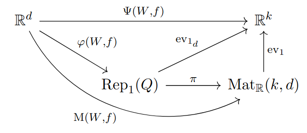

# Knowledge Matrix



Given a neural network (W,f) [1] with network function Ψ(W,f) and an input x ∈ ℝᵈ, compute the knowledge matrix M(W,f)(x). 
They were introduced in [2] and studied further in [3]. 

#### References 

[1] Armenta, M., Jodoin, P-M., <a href="https://arxiv.org/abs/2007.12213" target="_blank">The Representation Theory of Neural Networks</a> (2021)

[2] Armenta, M., Brüstle, T., Hassoun, S., Reineke, M., <a href="https://arxiv.org/abs/2109.14589" target="_blank">Double framed moduli spaces of quiver representations</a> (2021)

[3] Leblanc, S., Rasolomanana, A., Armenta, M., <a href="https://arxiv.org/abs/2409.13163" target="_blank">Hidden Activations Are Not Enough: A General Approach to Neural Network Predictions</a> (2024)

## Download & Use

You can download this using

```
pip install git+https://github.com/samueleblanc/knowledgematrix.git
```

For an example on how to use, please refer to [example.py](example.py).

## Large language models (Qwen3.5)

The library supports the hybrid Qwen3.5 / Qwen3-Next decoder architecture
(Gated DeltaNet linear attention, gated full attention with QK-Norm and
partial RoPE, SwiGLU, RMSNorm). Pretrained weights are loaded through the
optional dependency [transformers](https://github.com/huggingface/transformers)
(`pip install "knowledgematrix[hf]"`):

```python
from transformers import AutoTokenizer
from knowledgematrix.models.qwen3_5 import Qwen3_5
from knowledgematrix.matrix_computer import KnowledgeMatrixComputer

model = Qwen3_5.from_huggingface("Qwen/Qwen3.5-4B")
tokenizer = AutoTokenizer.from_pretrained("Qwen/Qwen3.5-4B")

x = tokenizer("Hello world", return_tensors="pt").input_ids.unsqueeze(0)  # (1, 1, seq_len)
computer = KnowledgeMatrixComputer(model, batch_size=32)
mat = computer.forward(x)  # (seq_len * vocab_size, seq_len * hidden_size + 1)
```

Note on size: with the language-model head the matrix has
`seq_len * vocab_size` rows, which is very large for a 4B model. Pass
`include_lm_head=False` to `from_huggingface` to stop at the final hidden
states (`seq_len * hidden_size` rows); since the head is linear, its rows
can be pushed through afterwards for the logits you need.

## Contributing

Any contribution is welcomed. Thank you in advance! 
However, we are primarily interested with help on the following:

* Implement other type of layers or other architecture.
* Improve memory efficiency or speed.

To set up, once the code is downloaded, simply run 
```
pip install -e .
```
in the root directory. 
Then, to run a file, for instance the test for AlexNet, run
```
python extra/tests/alexnet.py
```
again from the root directory.

## Authors

This code was written by Marco Armenta and Samuel Leblanc.

## License

MIT